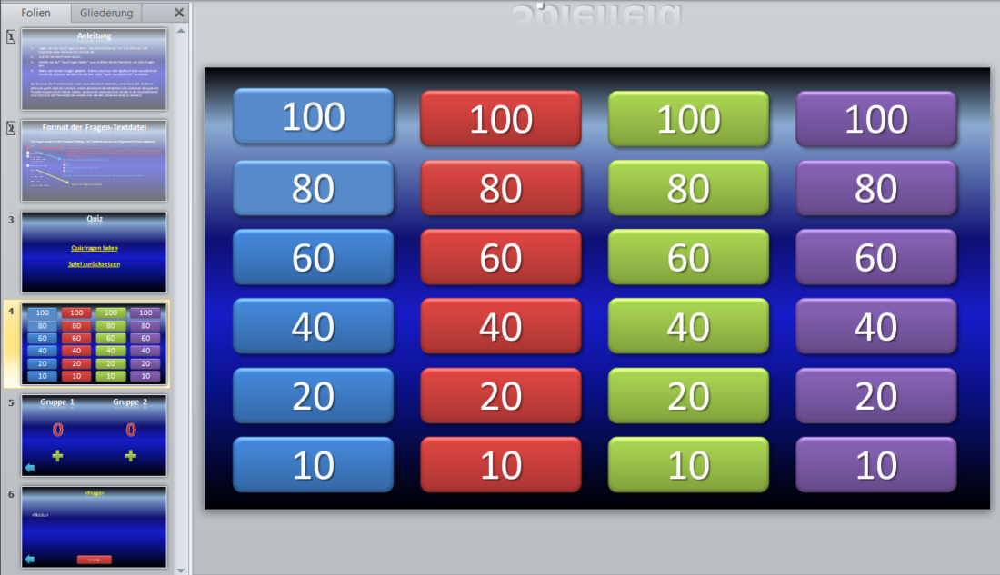

# Powerpoint Quiz
A quiz game for two groups - implemented using Powerpoint VBA

This screenshot shows how the quiz game in edit mode. Questions, options/notes and answer need to be provided in a separate text file. 

Please find an explanation of the format of this file on the hidden instructions slide. 
The presentation and the instructions are in German. Please use a translator of your choice if necessary.

The presentation can be stopped during the game. State is preserved. This allows for editing / correction during the game. The game can simply be continued by resuming the presentation. 

The subdirectory "scripts" contains the exported VBA code. It is not needed for running the quiz game. 

The textfile questions.txt contains a template for the questions file.

*Please note that this is my first Power Point VBA project. So don't consider any of the code / technique used to be best practice. In any case, I am always open for learning and I am looking forward to your feedback.*